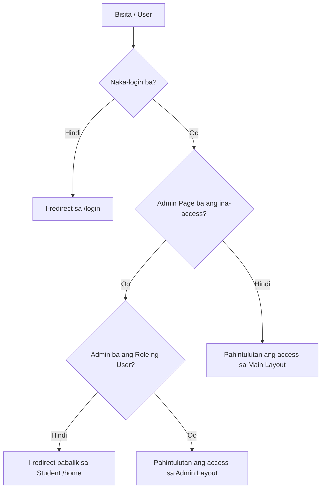

# 📝 PAANO GUMAGANA ANG INYONG WEBSITE? (TECHNICAL EXPLANATION GUIDE)

Isang simple ngunit detalyadong paliwanag kung paano gumagana ang inyong **Companion Website** sa likod ng entablado (under the hood). Makakatulong ito nang malaki upang maipaliwanag ninyo sa mga panel ang bawat bahagi ng system nang may buong linaw at katibayan.

---

## 🏗️ 1. ANG PANGUNAHING ARKITEKTURA: REACT + VITE
Ang inyong website ay isang **Single Page Application (SPA)** na binuo gamit ang **React** at **Vite**:
*   **Single Page Application (SPA):** Ibig sabihin, hindi nag-re-reload ang buong browser window tuwing nag-ki-click ka ng ibang pahina (tulad ng tungo sa Resources o Leaderboards). Ang React lamang ang nag-papalit ng mga components sa screen. Napakabilis nito at swabe ang user experience.
*   **Vite:** Ito ang modernong build tool na nag-ko-compile ng inyong code. Mas mabilis ito kumpara sa lumang Create React App (CRA) dahil sa paggamit ng native ES modules.

---

## 🔒 2. ANG SEGURIDAD AT ROUTING (PROTECTED ROUTES)
Paano gumagana ang pag-navigate at ang pagharang sa mga hindi awtorisadong gumagamit?

1.  **React Router DOM (`App.jsx`):** Ito ang namamahala sa mga links at URLs (tulad ng `/home`, `/resources`, at `/admin`).
2.  **ProtectedRoute Component (`ProtectedRoute.jsx`):** Ito ang inyong guwardiya.
    *   Bago ipakita ang `MainLayout` (Home, Leaderboards, Resources, etc.), tinitingnan muna nito kung ang user ay naka-login gamit ang Firebase Auth. Kung wala, awtomatiko silang ibinabalik sa `/login` screen.
    *   Bago naman ma-access ang `/admin` panel, tinitingnan nito kung ang gumagamit ay may field na `role === 'admin'` sa database. Kung regular student lamang ito, haharangan sila at ibabalik sa safe page.

---

## 🗄️ 3. ANG DATABASE AT CLOUD BACKEND: FIREBASE FIRESTORE
Sa halip na traditional na relational database (tulad ng MySQL kung saan may mga tables at columns), ang **Firestore** ay isang **NoSQL Document Database**:
*   **Collections:** Ito ang mga lalagyan o folders (tulad ng `users`, `lessons`, `forums`, `forum_comments`, at `activities`).
*   **Documents:** Ito ang mga individual files sa loob ng collection na nakasulat sa **JSON format**.
*   **Real-time Synchronization (`onSnapshot`):** Sa tradisyunal na PHP, kailangan mong magpadala ng request sa database at i-refresh ang page para makita ang bagong data. Sa Firestore, gumamit kayo ng listener hook (`onSnapshot`). Awtomatikong nag-o-open ng direct connection ang inyong browser sa cloud. Sa tuwing may magbabago sa Firebase cloud, kusa nitong ipapadala ang bagong data sa inyong React app upang i-update ang screen nang walang refresh.

---

## 📖 4. ANG DYNAMIC LESSON CMS AT CUSTOM MARKDOWN PARSER
Paano gumagana ang inyong Resources page at ang pagsusulat ng leksyon?

1.  **Admin Creation:** Ang guro ay magsusulat ng leksyon sa **Admin Lessons portal**. Upang madaling makabuo ng tables, lists, at bold text ang guro, gagamit sila ng **Markdown syntax** (halimbawa, `**Vowel**` para maging bold, o `| A | E |` para sa table grid).
2.  **Firestore Storage:** Ang leksyon ay nase-save sa `lessons` collection sa Firestore kasama ang `status: "Published"` o `"Draft"`.
3.  **Client Fetching:** Kapag binuksan ng estudyante ang **Resources page**, awtomatikong kinukuha ng React ang lahat ng documents mula sa `lessons` collection kung saan ang `status` ay `'Published'`.
4.  **The Custom Parser (`parseMarkdownToHTML`):** Kapag pinindot ng bata ang leksyon, binabasa ng system ang hilaw na markdown text at ipinapasa ito sa inyong parser function:
    *   Inaalis o iniiwasan muna ang mga mapanganib na character (escaping html characters) upang maiwasan ang hacking o code injection.
    *   Hahanapin ng RegExp (Regular Expressions) ang mga Markdown patterns (tulad ng asterisks o vertical pipes).
    *   Isasalin nito ang markdown patungong totoong HTML elements (tulad ng `<strong>`, `<ul>`, at `<table>`).
    *   Ika-load nito ang HTML sa modal popup gamit ang React property na `dangerouslySetInnerHTML`.

---

## 🏆 5. ANG REAL-TIME LEADERBOARD & ACHIEVEMENTS CALCULATOR
Paano gumagana ang pagraranggo at mga badge ng mga mag-aaral?

1.  **Game-to-Web Syncing:** Kapag nilaro ng bata ang 3D game sa computer, ise-save ng laro ang score sa profile ng user sa Firestore `users` collection.
2.  **Real-time Listening:** Ang website leaderboards component ay nakikinig sa `users` collection sa Firestore.
3.  **Sorting and Ranking:** Kinukuha ng React ang listahan ng users, sinasala (filter) upang tanggalin ang accounts ng mga admin/guro, at pinagsusunod-sunod (sort) ang scores mula sa pinakamataas hanggang sa pinakamababa.
4.  **Automatic Badging (`getAchievement` function):** Sa inyong code, may function na tinitingnan ang numeric score ng estudyante:
    *   Score $\ge$ 5000 $\rightarrow$ *"Word Master"*
    *   Score $\ge$ 4000 $\rightarrow$ *"Fast Solver"*
    *   Score $\ge$ 3000 $\rightarrow$ *"Minigames fanatic"*
    *   Score $\ge$ 2000 $\rightarrow$ *"Grammar Wizard"*
    *   Score $\ge$ 1000 $\rightarrow$ *"Spelling Bee"*
    *   Mababa sa 1000 $\rightarrow$ *"Beginner Reader"*
    *   Ito ay awtomatikong kinakalkula ng browser nang mabilis, kaya laging updated ang ipinapakitang titulo ng manlalaro nang walang manual database assignment.

---

## 👥 6. ANG SOCIAL STUDY FORUMS
Paano gumagana ang pag-uusap ng komunidad sa website?

1.  **Posting a Thread:** Kapag nag-click ng "New Discussion", nagse-save ng bagong document sa `forums` collection sa database kasama ang pangalan ng sumulat (`authorName`), nilalaman, at oras.
2.  **Commenting/Replying:** Kapag may sumagot sa thread, gumagawa ng document sa `forum_comments` collection na nakaturo sa `forumId` ng thread. Awtomatiko ring nag-a-add ng `+1` sa `commentsCount` field ng orihinal na forum post sa Firestore.
3.  **Self-Deletion:** Pinapayagan lamang ng code na makita ang "Delete Topic" button kung ang kasalukuyang naka-log in na `auth.currentUser.uid` ay tumutugma sa `authorId` ng post.

---

# 🚀 SUMMARY FOR THE PANEL (PAANO ITO IPAALAM SA KANILA)
Kapag tinanong kayo tungkol sa system architecture ng inyong website, maaari ninyong sabihin ito nang may kumpiyansa:

> *"Ang aming companion website po ay binuo bilang isang **Single Page Application** gamit ang **React** at **Vite** para sa mabilis at tuluy-tuloy na user experience. 
> 
> Ginamit po natin ang **Firebase (Firestore at Auth)** bilang serverless cloud backend. Dahil dito, lahat po ng data ng laro—mula sa Leaderboards ng mga bata, lessons na isinusulat ng mga guro sa aming CMS, hanggang sa real-time na usapan sa Forums—ay awtomatikong naka-sync sa web portal nang live at walang pagka-antala gamit ang WebSocket listeners. 
> 
> Mayroon din po kaming custom **Markdown-to-HTML parser** upang masiguro na ligtas at madaling makakapagdagdag ng curriculum learning materials ang ating mga guro gamit ang simpleng formatting."*
